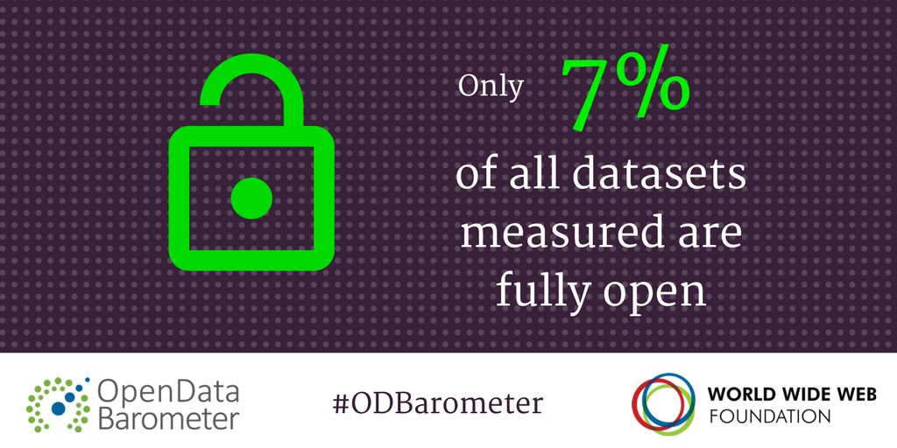
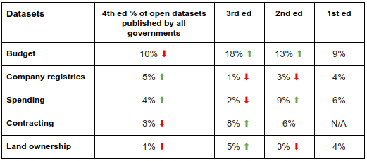
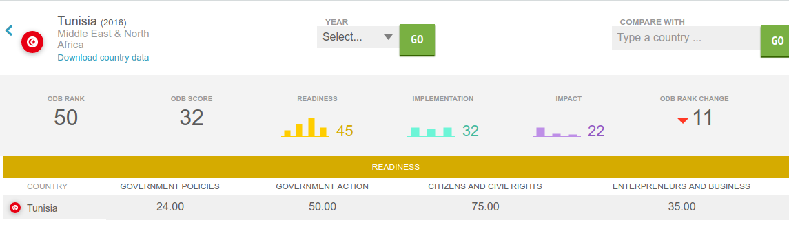

Aujourd'hui lancement officiel de la 4éme édition de l'open data barometer, de la web foundation. Un indice qui mesure le développement de l'open data dans le monde. TuniData vous rapporte en exclusivité les 5 découvertes de cette édition, ainsi que les résultats de la Tunisie. Bonne lecture et à la semaine prochaine.

La 4éme édition de l’Open Data Baromètre #ODBarometer
===

Aujourd’hui lancement officiel de la 4éme édition de l’ODB, le baromètre qui mesure le développement de l’open data dans les pays. Dans cette édition le baromètre couvre 115 pays, 1725 datasets dans 15 secteurs différents.

Neuf Datasets sur 10 ne sont pas ouvert
---

La recherche a trouvé que seulement 7% de données ouvertes dans le monde, soit 9 datasets sur 10 ne sont pas ouverts. 1 dataset sur deux est machine-readable, et 1 dataset sur 4 utilise une licence ouverte.

La recommandation de la Web Foundation : Les données gouvernementales doivent être ouverte par défaut. #OpenByDefault

Les données gouvernementales sont généralement incomplètes et de mauvaise qualité
---

Les données gouvernementales sont généralement incomplètes, ne sont pas à jour, de mauvaise qualité et fragmentées. Dans la plupart des cas, les catalogues de données ouvertes ou les portails sont alimentés manuellement à la suite d'approches informelles de gestion de données. Les procédures, les délais et les responsabilités ne sont souvent pas clairs parmi les institutions gouvernementales chargées de ce travail. Cela rend l'approche globale de la gestion et de la publication des données ouvertes faible et sujettes à de multiples erreurs.

Malgré que 79 pays sur 115 disposent d’un portail national open data, la majorité des données dans ces pays (61%) ont été retrouvés dans d’autres agences gouvernementales. D’autres part même si les données sont publiées en ligne, elles sont difficile à utiliser vu que seulement moins d'un tiers (31%) des ensembles de données publiés ont des métadonnées de documentation d'accompagnement complémentaires.

La recommandation de la Web Foundation : Les gouvernements doivent décentraliser la gestion les données ouvertes dans tous les organismes et départements

La volonté politique soutenue est ce qui fait ou brise le succès des données ouvertes
---

L'élan politique est essentiel pour le lancement et le développement à grande échelle de données ouvertes. L'importance des décisions politiques est démontrée par des pays tels que l'Ukraine, l'Argentine, les Philippines, le Burkina Faso et la Tanzanie, ce qui a connu de grandes améliorations dans les scores et les classements du Barometer dans cette édition.

Cependant, la volonté politique doit se traduire par de solides fondements juridiques et politiques, comme dans le cas du Canada, le Mexique, le Japon et la Corée - qui ont réalisé des progrès constants dans leur classement du baromètre.

La recommandation de la Web Foundation : les gouvernements doivent adopter la Charte des données ouvertes pour s'assurer que les pratiques ouvertes en matière de données sont intégrées au-delà des mandats politiques.

Les gouvernements ne publient pas les données nécessaires pour rétablir la confiance des citoyens
---

Les portails de données ouvertes ne contiennent souvent pas les données que les gens veulent et ont vraiment besoin. Les gouvernements doivent investir dans l'ouverture des ensembles de données dont les gens ont besoin (par exemple, les données sur le budget, les dépenses, les contrats et les registres de l'entreprise). Ces ensembles de données ont toujours tendance à être très opaques et souvent les moins ouvertes.

Comme résultats montrent dans cette édition, il y a un nombre limité de gouvernements qui ont des données vraiment ouvertes sur ces sujets et pourtant ce sont les ensembles de données qui sont essentielles pour lutter contre la corruption et permettre à la responsabilité du gouvernement. Les gouvernements ont clairement besoin d'intensifier leur jeu.

La recommandation de la Web Foundation : Les gouvernements pour donner la priorité des les données ouvertes à publier en premier doivent consulter les citoyens et les intermédiaires.

Peu d'initiatives de données ouvertes favorisent activement l'inclusion et l'équité
---

Comme les années précédentes, les chercheurs ont trouvés des preuves que les données ouvertes contribuent à la croissance économique et à la création de nouvelles entreprises, mais peu ou pas de preuve qu'elles contribuent à l'inclusion sociale (que ce soit en améliorant l'accès des groupes exclus aux services publics ou en augmentant leur participation aux décisions politiques). Bien que ce soit une excellente nouvelle selon laquelle les données ouvertes contribuent à créer des emplois et à une croissance, nous ne devons pas simplement supposer qu'une marée montante soulève tous les bateaux.

La recommandation de la Web Foundation : Les gouvernements doivent investir dans l'utilisation de données ouvertes pour améliorer la vie des groupes marginalisés.

Consulter les résultats sur le site officiel http://opendatabarometer.org.

L'OpenData en Tunisie
===

Dans cette édition de l’ODB la Tunisie a perdu 11 places dans le classement général pour arriver à la 50éme position avec un score de 32 comparé à 33 l’année dernière. Inutile de vous raconter le détail du score parceque généralement si rien de remarquable n'a changé dans le pays, il faut pas s'attendre à voir un changement dans le score, ce qui est notre cas pour 2015-2016.

On a un nouveau portail open data qui a été réalisé, mais qui n'est pas encore publié. On a une nouvelle stratégie egov/opengov qui vient d'être élaboré et qu'il faut mettre en application. On a une nouvelle loi d'accès à l'information qui est entré en application à partir de Mars 2016, mais son texte d'application n'est toujours pas prêt.

On a plusieurs initiatives et engagements qui concerne l'opendata dans l'ancien plan OGP, et dans le second plan, mais ceci concerne 2016-2018.

Grosso-modo, théoriquement on a beaucoup de choses mais pratiquement sur terrain on n'a rien du tout. L'OpenData n'est pas uniquement l'ouverture des données publiques, mais c'est principalement la valorisation de ces données. Si on ne développe pas l'open data en Tunisie avec cet esprit, on ne peut pas s'attendre à en tirer des bénéfices.

Donc pour finir, mes recommendations pour cette année :

 1. Accélérer la mise en application de la nouvelle loi d'accès à l'information et de son instance.
 2. Renforcer la communication entre le créateur et le consommateur de données à travers des campagnes de sensibilisation, formation, et développement de solutions.
 3. Adopter et commencer à appliquer les principes de l'ODC
